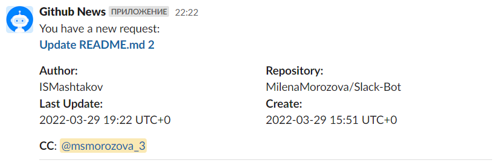

# Slack-Bot

The application, which send the Pull Request information from Github to Slack channels.

### Instruction
1. Add `Github News` application to Slack workspace and to channels, where you want to see messages
2. Add `BotGithubNews` application to your Github repository
3. Subscribe your channel using Slack command 
```
/subscribe-channel <github_repository_full_name>
```
4. If you want to be mentioned in messages, run the command:
```
/mention-me <your_github_account>
```
As a result you will receive messages like:


Links:
- [Link to post design in Block Kit Builder](https://app.slack.com/block-kit-builder/T038CJQ34F9#%7B%22blocks%22:%5B%7B%22type%22:%22section%22,%22text%22:%7B%22type%22:%22mrkdwn%22,%22text%22:%22You%20have%20a%20new%20request:%5Cn*%3CfakeLink.toEmployeeProfile.com%7CNew%20device%20request%3E*%22%7D%7D,%7B%22type%22:%22section%22,%22fields%22:%5B%7B%22type%22:%22mrkdwn%22,%22text%22:%22*Author:*%5CnComputer%22%7D,%7B%22type%22:%22mrkdwn%22,%22text%22:%22*Repository:*%5CnSlack-Repo%22%7D,%7B%22type%22:%22mrkdwn%22,%22text%22:%22*Last%20Update:*%5Cn2022-03-29%2019:25%20UTC+0%22%7D,%7B%22type%22:%22mrkdwn%22,%22text%22:%22*Create:*%5Cn2022-03-29%2019:25%20UTC+0%22%7D%5D%7D,%7B%22type%22:%22section%22,%22text%22:%7B%22type%22:%22mrkdwn%22,%22text%22:%22*CC*:%20@Milena,%20@Igor%22%7D%7D,%7B%22type%22:%22divider%22%7D%5D%7D)
- [BotGithubNews Github App](https://github.com/apps/botgithubnews)

### Slack Commands  

| Command        | Description  |
| -------------  | :-----|
| `/mention-me <your_github_account>` | mention slack user when Github repository are update |
| `/stop-mention-me` |   stop mention slack user when Github repositories are updated |
| `/subscribe-channel <github_repository_full_name>`      |    subscribe slack channel to Github repository |
| `/unsubscribe-channel <github_repository_full_name>`      |    unsubscribe slack channel from Github repository |
| `/unsubscribe-channel-from-all-repositories`    |    unsubscribe slack channel from all Github repository |
| `/channel-repositories`      |    display all the repositories to which the channel is subscribed |

Useful documentation:
1. [Slack Api Documentation](https://api.slack.com/start/building/bolt-python)
2. [Github REST Api Documentation](https://docs.github.com/en/rest)
